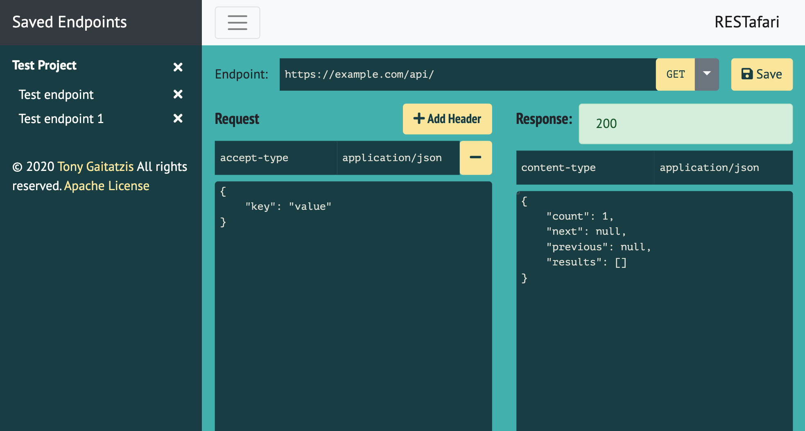

# RESTafari

This project lest you test a REST API from the browser. 
With it you can
* Save and load API tests,
* Edit the endpoint url,
* Add and remove request headers
* Edit the request body

Currently this supports JSON REST APIs only

Here's what it looks like.

Run it locally (no web server required) or try it out online [http://backupbrain.github.io/restafari](http://backupbrain.github.io/restafari).

Enjoy

